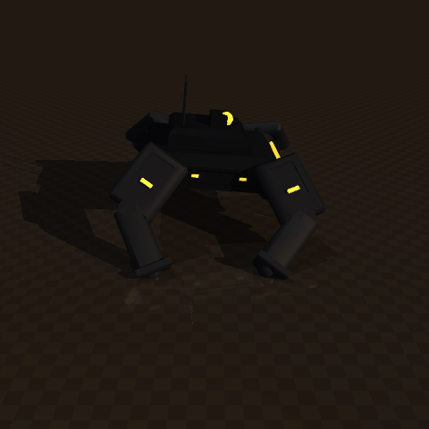
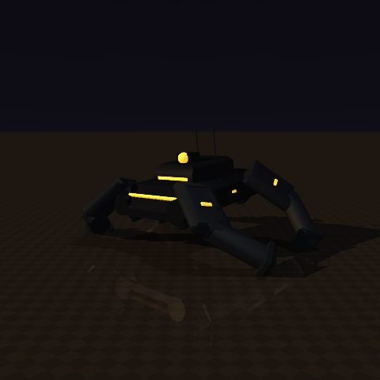

# 4-leg-robot

A custom MuJoCo quadruped (spyder), built up from a drop-in copy of Gymnasium's `Ant-v5`
into a real **12-DoF "tank" quad** (`Spyder-v0`) with CAD-authored (build123d) meshes.

<table>
  <tr>
    <td align="center"></td>
    <td align="center"></td>
  </tr>
  <tr>
    <td align="center"><sub>gentle-policy rollout — front three-quarter</sub></td>
    <td align="center"><sub>same rollout — amber-visor angle</sub></td>
  </tr>
</table>

- Setup & commands: [`CLAUDE.md`](CLAUDE.md)

## The 12-DoF tank quad (Spyder-v0)

Two environments: `mujoco-env` (Python 3.14, training/rendering) and `cad-env`
(Python 3.13, build123d mesh authoring — build123d has no 3.14 wheel).

```bash
# 1. author the tank meshes (build123d -> STL), then the MJCF + URDF
./cad-env/bin/python    scripts/make_meshes.py        # trunk/hip/thigh/shank/sensor STLs
./mujoco-env/bin/python scripts/make_quad_xml.py      # -> models/spyder_quad.xml (generated)
./mujoco-env/bin/python scripts/make_quad_urdf.py     # -> urdf/spyder_quad.urdf (portable)

# 2. preview the look (no physics) and prove it stands (Spyder-v0 contract)
./mujoco-env/bin/python scripts/render_robot.py       # hero + part previews
./mujoco-env/bin/python scripts/check_spyder.py       # 1 free + 12 hinge, 12 motors, stands

# 3. see it live / record a clip
./mujoco-env/bin/mjpython scripts/view.py models/scene_quad.xml                 # orbit
./mujoco-env/bin/mjpython scripts/view.py models/scene_quad.xml --physics       # watch it move
./mujoco-env/bin/python  scripts/view.py models/scene_quad.xml --save out.gif --main-body trunk
./mujoco-env/bin/python  scripts/view.py models/scene_quad.xml --save out.gif --main-body trunk \
    --cam-azimuth 225 --cam-elevation -8 --cam-distance 2.4   # same rollout, second angle
```

All geometry flows from one source of truth, `scripts/spyder_params.py`.
