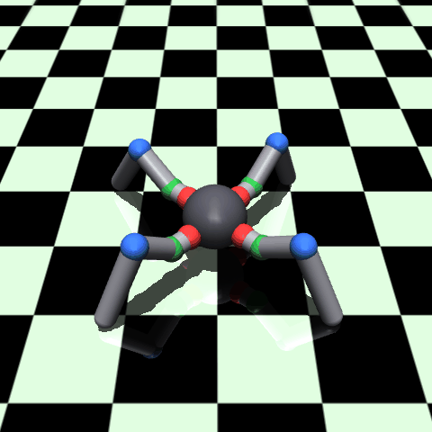
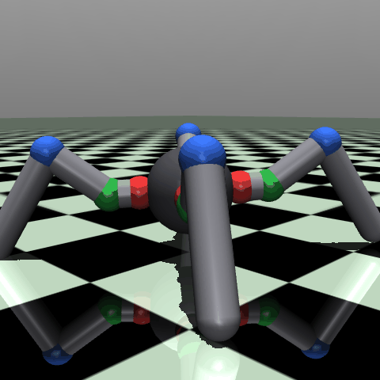

# 4-leg-robot

A custom MuJoCo quadruped (**spyder**), built up from a drop-in copy of Gymnasium's
`Ant-v5` (8 DoF) into a real **12-DoF spider** (`Spyder-v0`) — same body, same
X-stance, one extra *lift* joint per leg.

<table>
  <tr>
    <td align="center"></td>
    <td align="center"></td>
  </tr>
  <tr>
    <td align="center"><sub>wave-policy rollout — front three-quarter</sub></td>
    <td align="center"><sub>same rollout — side profile</sub></td>
  </tr>
</table>

- Setup & commands: [`CLAUDE.md`](CLAUDE.md)
- Full design rationale & tuning guide: [`docs/design_spyder12.md`](docs/design_spyder12.md)

## Why 12 DoF (the 10-second version)

A foot's position is **three numbers** (forward/back, up/down, near/far) and each
joint controls one. The Ant's 2 joints per leg trap the foot on a thin curve — it
can shuffle and turn, but never *lift* a foot to place it. Adding one lift joint
per leg (4 × 3 = 12) lets each foot reach anywhere in its workspace: stepping,
climbing, crouching, and terrain work all come from that one change. Joint colors
in the renders mark the layout: 🔴 hip (sweep) · 🟢 lift (**the new joint**) · 🔵 knee (fold).

| | `models/spyder.xml` | `models/spyder12.xml` |
|---|---|---|
| joints per leg | 2 (hip, ankle) | 3 (hip, **lift**, knee) |
| action / obs | `(8,)` / `(105,)` | `(12,)` / `(113,)` |
| env id | `Ant-v5` (byte-compatible) | `Spyder-v0` (`envs/spyder_env.py`) |
| checked by | `scripts/check_compat.py` | `scripts/check_spyder.py` |

## Commands

```bash
# prove the contracts hold
./mujoco-env/bin/python scripts/check_compat.py     # 8-DoF file is still drop-in Ant-v5
./mujoco-env/bin/python scripts/check_spyder.py     # Spyder-v0: 12 hinge/12 motor, stands

# see it live (macOS: live windows need mjpython)
./mujoco-env/bin/mjpython scripts/view.py models/scene12.xml                    # orbit/poke
./mujoco-env/bin/mjpython scripts/view.py models/scene12.xml --physics --policy wave

# record the README clips (headless, no window)
./mujoco-env/bin/python scripts/view.py models/scene12.xml --save docs/media/spyder12_preview.gif --policy wave
./mujoco-env/bin/python scripts/view.py models/scene12.xml --save docs/media/spyder12_side.gif --policy wave \
    --cam-azimuth 225 --cam-elevation -10 --cam-distance 2.6
```

`--policy wave` is a hand-scripted trot-phased sinusoid (no training) — enough to
show the legs lifting. Real gaits come from RL (next phase: terrain + training).

## Repo map

- `models/spyder.xml` + `scene.xml` — the 8-DoF Ant-v5 twin (kept as baseline/reference).
- `models/spyder12.xml` + `scene12.xml` — the 12-DoF spider (the robot this repo is about).
- `envs/spyder_env.py` — registers `Spyder-v0` on Gymnasium's stock `AntEnv`.
- `scripts/` — contract checks (`check_compat.py`, `check_spyder.py`), viewer/recorder (`view.py`), URDF export (`make_urdf.py`).
- `docs/design_spyder12.md` — the full design doc: joint layout, geometry, physics choices, tuning knobs.
